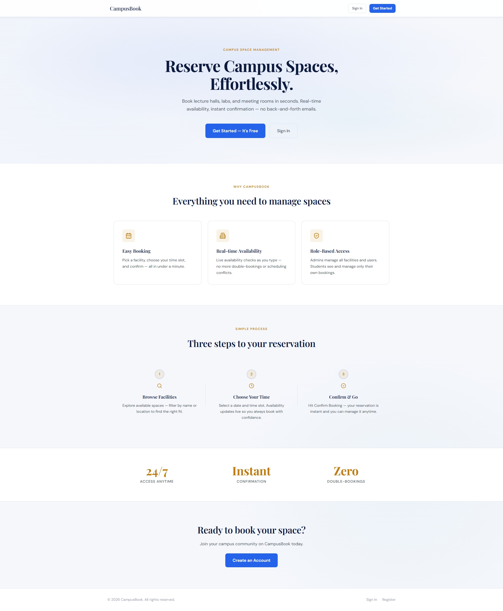

# CampusBook — Facility Booking Microservice

**Contributors:**

- Daniel Agyin Manford - 11015506
- Kudiabor Jonathan Kwabena Ewenam - 11254301

**Github:** https://github.com/jk-ewenam20/CPEN421-campus-booking-facility-ms.git

A full-stack campus space reservation system. Students browse available facilities and book time slots in real time. Admins manage facilities, users, and all bookings through a dedicated dashboard.


---

## Tech Stack

| Layer    | Technology                                                  |
| -------- | ----------------------------------------------------------- |
| Backend  | Spring Boot 3.5.x, Java 21, Spring Security (session-based) |
| Database | PostgreSQL 15+                                              |
| API Docs | SpringDoc OpenAPI 2.8.x (Swagger UI at `/swagger-ui.html`)  |
| Frontend | React 18 + Vite, React Router v6                            |
| Styling  | Custom CSS design system (no external CSS framework)        |
| Hosting  | Render (backend + DB) · Vercel (frontend)                   |

---

## Architecture

```
┌─────────────────────┐        ┌──────────────────────────┐
│   Vercel (Frontend) │ ──────▶│   Render (Spring Boot)   │
│   React / Vite      │  HTTPS │   Port 8080              │
│   campus-booking-   │◀────── │   Session cookie auth    │
│   frontend.vercel.  │        │   PostgreSQL on Render   │
│   app               │        └──────────────────────────┘
└─────────────────────┘
```

- **Auth**: HTTP session (JSESSIONID cookie). Login → `POST /auth/login` sets cookie; all subsequent API calls include it via `credentials: 'include'`.
- **Roles**: `ADMIN` (full CRUD) and `USER` (own bookings only, read-only facilities).
- **CORS**: Configured via `cors.allowed.origins` property; `SameSite=None; Secure` in production profile.

---

## Prerequisites

- Java 21 (JDK)
- Maven 3.9+
- PostgreSQL 15+ (local instance or Docker)
- Node.js 20+ and npm

---

## Local Development

### 1. Database

```sql
CREATE DATABASE campus_booking_db;
```

### 2. Backend

```bash
# From project root
cp src/main/resources/application.properties src/main/resources/application.properties.bak

# Update DB credentials in application.properties if needed, then:
./mvnw spring-boot:run
```

Backend runs at **http://localhost:8080**.
Swagger UI: **http://localhost:8080/swagger-ui.html**

### 3. Frontend

```bash
cd campus-booking-react-frontend/campus-booking-frontend
npm install
npm run dev
```

Frontend runs at **http://localhost:3000** (Vite proxies API calls to `:8080`).

---

## Environment Variables

### Backend (`application.properties` / system env)

| Variable                 | Default                 | Description                                              |
| ------------------------ | ----------------------- | -------------------------------------------------------- |
| `CORS_ALLOWED_ORIGINS`   | `http://localhost:3000` | Comma-separated list of allowed frontend origins         |
| `APP_SERVER_URL`         | `http://localhost:8080` | Backend URL shown in Swagger UI server list              |
| `SPRING_PROFILES_ACTIVE` | _(none)_                | Set to `prod` on Render for cross-origin cookie settings |

### Frontend (`.env`)

| Variable            | Default   | Description                                                               |
| ------------------- | --------- | ------------------------------------------------------------------------- |
| `VITE_API_BASE_URL` | _(empty)_ | Leave empty for local dev (Vite proxy). Set to Render URL for production. |

Copy `.env.example` to `.env` for local setup:

```bash
cp .env.example .env
```

---

## API Endpoints Summary

| Method | Path                     | Auth           | Description                      |
| ------ | ------------------------ | -------------- | -------------------------------- |
| POST   | `/auth/login`            | Public         | Login — returns session cookie   |
| POST   | `/auth/logout`           | Authenticated  | Invalidate session               |
| POST   | `/users`                 | Public         | Register new user                |
| GET    | `/users`                 | ADMIN          | List all users                   |
| GET    | `/users/{id}`            | Self or ADMIN  | Get user by ID                   |
| PUT    | `/users/{id}`            | Self or ADMIN  | Update user                      |
| DELETE | `/users/{id}`            | ADMIN          | Delete user                      |
| GET    | `/facilities`            | Public         | List all facilities              |
| GET    | `/facilities/{id}`       | Public         | Get facility by ID               |
| POST   | `/facilities`            | ADMIN          | Create facility                  |
| PUT    | `/facilities/{id}`       | ADMIN          | Update facility                  |
| DELETE | `/facilities/{id}`       | ADMIN          | Delete facility                  |
| GET    | `/bookings`              | Authenticated  | List bookings (filtered by role) |
| POST   | `/bookings`              | Authenticated  | Create booking                   |
| PUT    | `/bookings/{id}`         | Owner or ADMIN | Update booking                   |
| DELETE | `/bookings/{id}`         | Owner or ADMIN | Cancel booking                   |
| GET    | `/bookings/availability` | Authenticated  | Check time-slot availability     |

---

## Deployment

### Backend on Render

1. Create a **Web Service** connected to this repo.
2. Build command: `./mvnw clean package -DskipTests`
3. Start command: `java -jar target/facility-booking-ms-*.jar`
4. Add environment variables:
   - `SPRING_PROFILES_ACTIVE` = `prod`
   - `CORS_ALLOWED_ORIGINS` = `https://<your-frontend>.vercel.app`
   - `APP_SERVER_URL` = `https://<your-backend>.onrender.com`
   - `SPRING_DATASOURCE_URL` = (from Render PostgreSQL)
   - `SPRING_DATASOURCE_USERNAME` / `SPRING_DATASOURCE_PASSWORD`

### Frontend on Vercel

1. Import `campus-booking-react-frontend/campus-booking-frontend` as a Vercel project.
2. Framework preset: **Vite**
3. Add environment variable:
   - `VITE_API_BASE_URL` = `https://<your-backend>.onrender.com`
4. Deploy.

---

## Troubleshooting

### CORS errors

- Ensure `CORS_ALLOWED_ORIGINS` on Render exactly matches your Vercel URL (no trailing slash).
- Production profile (`SPRING_PROFILES_ACTIVE=prod`) must be active for `SameSite=None; Secure` cookies.

### Session / cookie not sent

- In production, both Vercel (HTTPS) and Render (HTTPS) must use `https://`. The `Secure` flag on the cookie requires HTTPS.
- The frontend must use `credentials: 'include'` on all fetch calls (already configured in `src/api/client.js`).

### Bookings not showing for regular users

- Ensure the backend returns `name` in the login response. The `user.name` field in sessionStorage is what the booking filter uses.
- Check `sessionStorage.getItem('cbms_user')` in browser devtools — it should contain a `name` field.

### Swagger UI not loading

- Uses springdoc-openapi **2.8.x** — do not downgrade to 2.5.x (incompatible with Spring Framework 6.2.x).
- `server.compression.enabled=false` must remain in `application.properties`.
